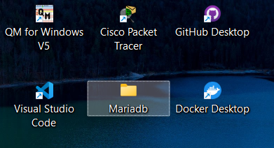
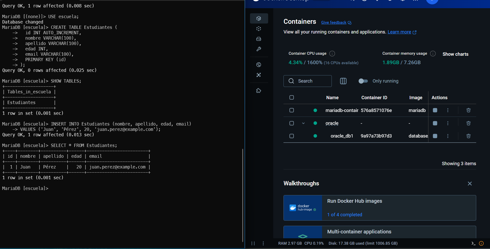
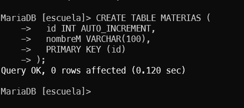
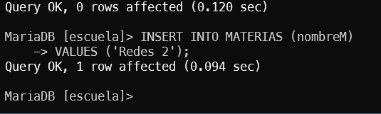
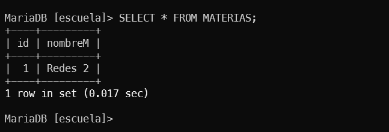

# 1 MariaDB "los innovadores" (Maria, gladimir, Omar).

Grupo que ejecuto: "lorelai" (jhamil)

<!-- italic  -->
Al incio cree una carpeta de donde se crearia el contenedor

## despues todos los comandos que mostro en el git se ejecuto normal sin errores

## 1 Inserte un tabla nuevo

## 2 Inserte un dato en la tabla

## 3 Salio resultado

<!-- italic  -->
### Comentario

<!-- ul  -->
* No dio nungun error con los codigos
* si se entendio como se instalo